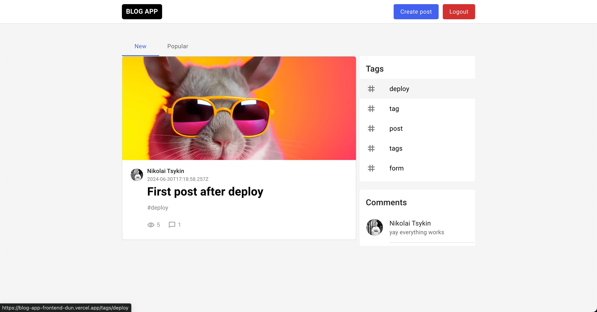

## Blog app - Full stack blog-like web application
Website Description: Blog App

The Blog App is a streamlined web application built to showcase and manage blog posts, providing users with a platform to explore, read, and possibly interact with various entries. This platform demonstrates a clean and responsive layout that enhances readability and user interaction with the blog content.

Core Function: To offer a space for creating, viewing, and managing blog posts in a well-organized, accessible format.

Target Audience: Individuals interested in reading or managing blog posts, as well as users looking for an engaging, organized interface to interact with blog content.

Unique Selling Points: Modern and simple user interface that highlights the blog content, responsive design ensuring accessibility across devices, and structured navigation for easy browsing and content management.

Key Features:

Home Page with Blog List: Displays a list of blog posts for easy access, allowing users to quickly identify posts they wish to read.
Individual Blog Post Pages: Clicking on a post takes users to a dedicated page where the entire post is displayed in a clean, focused layout.
Responsive Design: Adjusts seamlessly for both mobile and desktop, ensuring a smooth experience across all devices.
Simple Navigation: Clear and easy-to-use navigation enhances the browsing experience, allowing users to transition between pages without confusion.
Clean, Content-Focused Layout: The app uses ample whitespace and clear typography to keep users' focus on the content.
Design Aesthetic: Modern, minimalistic, and focused on readability. The app uses clean lines, white space, and a structured layout to draw attention to each blog post.
User Experience: Designed with usability in mind, the interface is intuitive, allowing users to navigate the app with ease, whether they are on a desktop or mobile device. This layout and design approach ensure that readers enjoy a smooth, uninterrupted reading experience.

The Blog App reflects strong front-end development skills, prioritizing user engagement and content organization. Its responsive, minimalist design supports an intuitive user experience ideal for displaying blog content.

Stack: MongoDB, ExpressJS, React JS, NodeJS, SASS.

Deployment: https://blog-app-frontend-dun.vercel.app/

The main page

Utilized Material UI components from the @mui/material library, such as Tabs and Grid. 

Tabs

Post sorting by tags

Implemented user authentication with login and registration components. 

Login page

Registration page

Leveraged Redux for state management, including an action to fetch user data, posts, tags and comments.
Stack: React, Redux, MongoDB, Express, Node, SASS, Git

